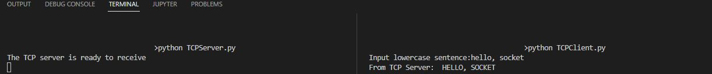

# Ex02 - Echo by TCP
This project reimplements the server and client programs of Ex001 based on TCP. The client sends a message to the server, which receives the message, converts it to uppercase, and sends it back to the client.

## 0. Language
Python 

## 1. Screens

<b>Sample</b> 

## 2. Demo
To be included.

## 3. How to run the code
In two terminals on one machine or two machines in a LAN, run `python TCPServer.py` and `python TCPClient.py` respectively. Follow the instructions to check the functionalities.