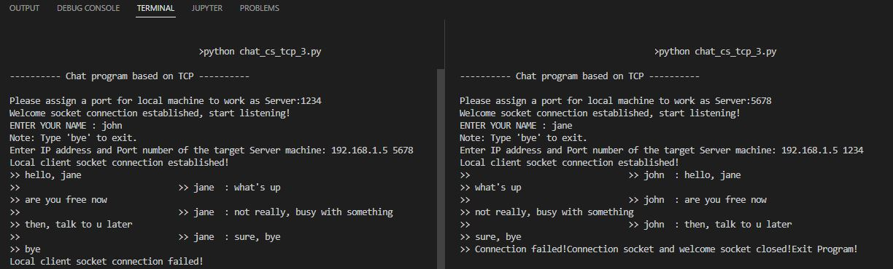

# Ex04 - 1to1 Chat by TCP
This project reimplements the 1to1 chat program of Ex003 based on TCP. The machine serves as both a server and a client to receive and send messages.

## 0. Language
Python 

## 1. Screens

<b>Sample</b> 

## 2. Demo
To be included.

## 3. How to run the code
In two terminals on one machine or two machines in a LAN, run `python chat_cs_tcp.py`. Follow the instructions to check the functionalities.