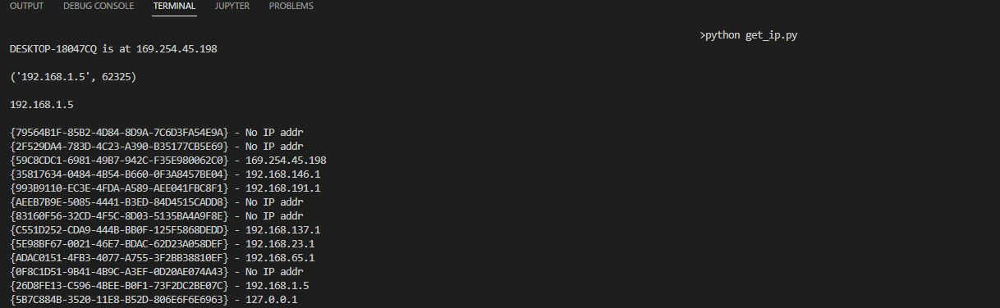

# Ex05 - Get IP
This project implements the functionality to get the IPs of the local machine.

## 0. Language
Python 

## 1. Screens

<b>Sample</b> 

## 2. Demo
To be included.

## 3. How to run the code
In the terminal, run `python get_ip.py`. Follow the instructions to check the functionalities.