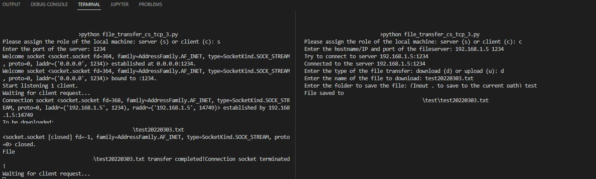
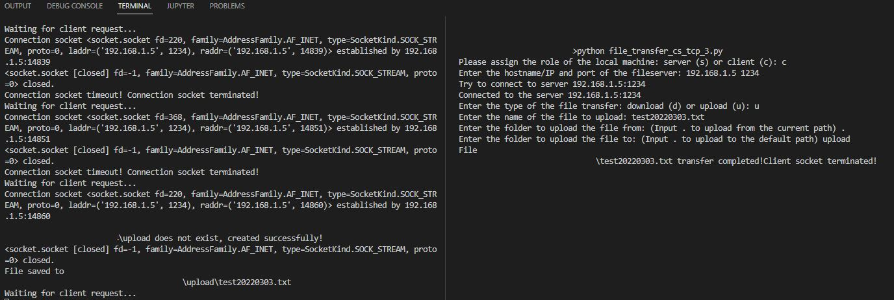

# Ex06 - File Transfer by TCP
This project reimplements the file transfer program based on TCP. The local machine can serve as a server to listen to client requests to upload or download files. The client is able to upload or download files from or to specific directories.

## 0. Language
Python 

## 1. Screens

<b>Download</b> 

<b>Upload</b> 

## 2. Demo
To be included.

## 3. How to run the code
In two terminals on one machine or two machines in a LAN, run `python file_transfer_cs_tcp.py`. Follow the instructions to check the functionalities.